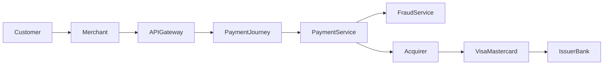

# Payment Processing Architecture

Este repositorio contiene una implementación completa de documentación arquitectónica utilizando:

- C4 Model
- UML
- Event Driven Architecture
- PCI DSS Scope Modeling
- Infrastructure Architecture
- ADRs

---

# Diagramas

## C4 Model

| Nivel | Descripción |
|---------|------------|
| [Context Diagram](./c4/01-context-diagram.md) | Vista de negocio |
| [Container Diagram](./c4/02-container-diagram.md) | Vista de aplicaciones |
| [Component Diagram](./c4/03-component-diagram.md) | Vista interna de servicios |

---

## UML

| Diagrama | Descripción |
|-----------|------------|
| [Payment Authorization Sequence](./uml/04-sequence-payment-authorization.md) | Flujo de autorización |
| [Deployment Diagram](./uml/05-deployment-diagram.md) | Infraestructura |
| [Domain Model](./uml/06-domain-model.md) | Modelo de dominio |

---

## Architecture

| Diagrama | Descripción |
|-----------|------------|
| [Event Flow](./architecture/07-event-flow.md) | Arquitectura orientada a eventos |
| [PCI Data Flow](./architecture/08-data-flow-pci.md) | Flujo de datos PCI |
| [Infrastructure Topology](./architecture/09-infrastructure-topology.md) | Infraestructura Cloud |

---

## ADR

| Documento |
|------------|
| [ADR-001 Event Driven Processing](./adr/ADR-001-Event-Driven-Payment-Processing.md) |

---

# Caso de Uso

El sistema procesa pagos con tarjetas Visa y Mastercard utilizando:

- API Gateway
- Payment Journey Service
- Payment Service
- Fraud Service
- Acquiring Processor
- Card Networks
- Issuing Banks

---

# Arquitectura General

